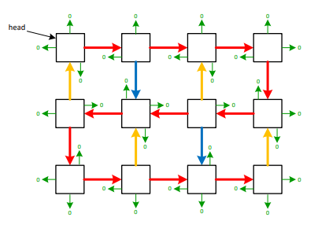

# Boustrophedonic-List

Boustrophedonic - Greek word: A method of writing shown in early Greek inscriptions, in which the lines run alternately from right to left and from left to right, as the furrows made in plowing a field, the plow passing alternately backward and forward.
This project is based off of a node structure where each node has North, South, East, West pointers, but can only be linked in the Boustrophedonic format. This was created from a class project1 (Optomized C++). 

Successfully created proficient function to:
* Delete/Remove specific Node in the linked list
* Keep horizontal and vertical connections through the deleted node
* Fix adjacent node connections

## Credit
1 - Copyright 2022, Ed Keenan, all rights reserved.
